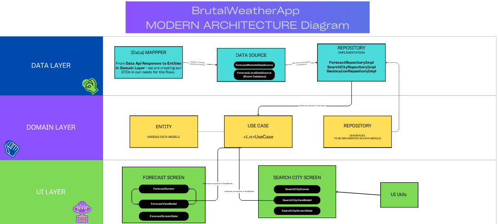
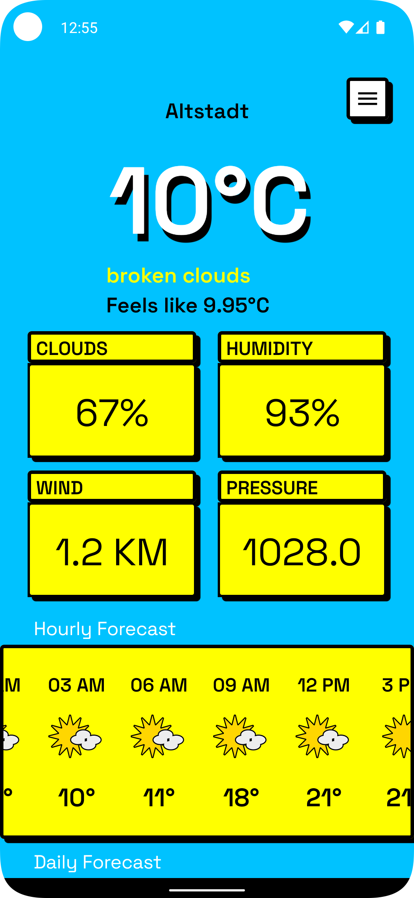
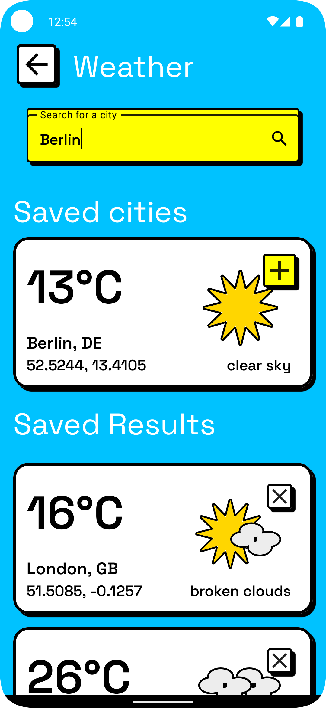
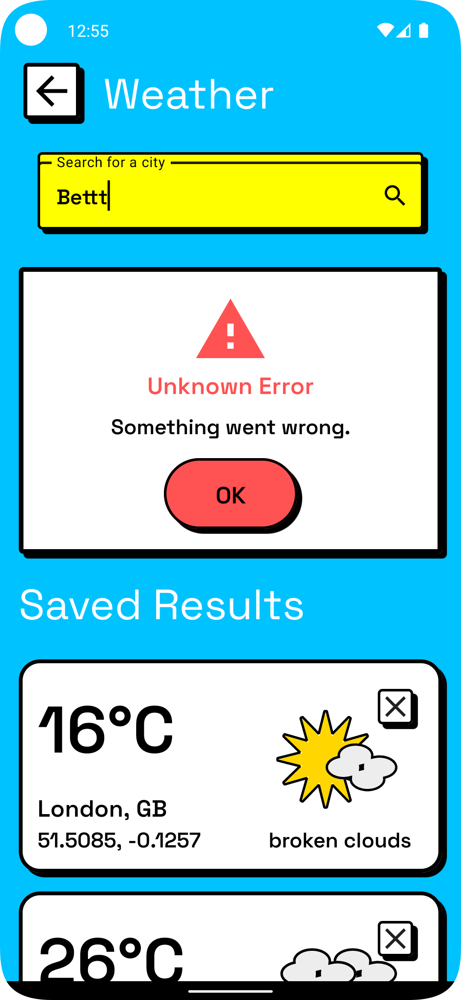
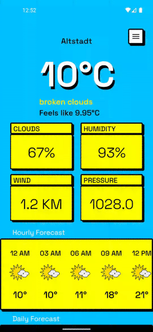
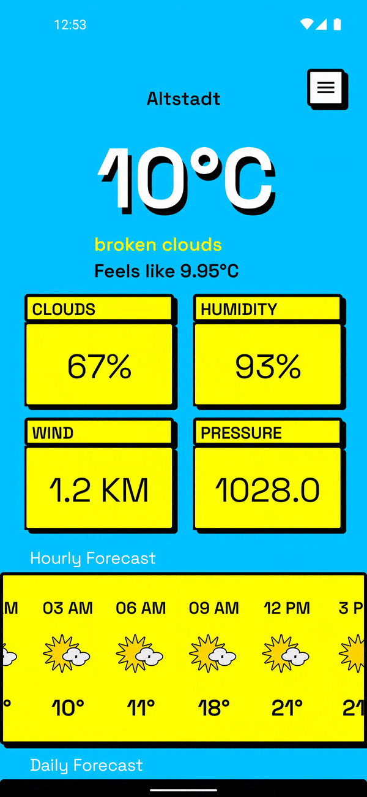

# ModernArchWeatherApp - Modern Architecture Android App with Kotlin & Jetpack Compose 🚀
- Welcome to BrutalWeatherApp Android application, developed with Modern Android Architecture in mind, Kotlin, and the power of Jetpack Compose. Clean code structure with clear separation of concerns and unidirectional data flow. UI is inspired by the Neubrutalism Style.

<br/>

**This Project  Is Built To Demonstrate Usage Of Google's Recommended Android Development Tools - (Coroutines, Hilt, Modern Architecture Components, Udf, Room, Retrofit, Material Components, Accompanist Lib, and version catalog.**<br/>

The UI is done with simplicity, in the Neobrutalism style, as the focus and the emphasis are placed on robust and clean project architecture. 

  


## What is included:
* **Unidirectional Data Flow**: Ensuring a consistent and predictable behavior.
* **MVI Pattern:** A robust pattern that simplifies user interactions and data updates.
* **Separated Concerns**: Each layer has its distinct responsibility, promoting clarity and simplicity.
* **Single Source of Truth**: All layers rely on one authoritative data source, eliminating inconsistencies.
* **Domain Layer**: An optional layer that encapsulates all the business logic, making the app robust and efficient, making the app's core functions clear and concise.
* **Loose Coupling and DI**: Used Dependency Injection pattern ensuring that components are independent yet interconnected, enhancing flexibility.


<br/>


## Api 📦
* [OpenWeather forecast endpoint, version 2.5](https://openweathermap.org/forecast5)
* You can add your Weather API key in the *Constants*.kt [YOUR_API_KEY] file in the data/config folder.


# Technologies used 📚
- [Kotlin](https://kotlinlang.org/) - Kotlin is an official programming language for Android development.
- [Jetpack Compose](https://developer.android.com/jetpack/compose) - Jetpack Compose is Android’s recommended modern toolkit for building native UI. 

### Libraries 📚


* [Navigation](https://developer.android.com/jetpack/compose/navigation)
* [Retrofit](https://square.github.io/retrofit)
* [Location](https://developer.android.com/training/location)
* [Hilt](https://developer.android.com/training/dependency-injection/hilt-android)
* [Room](https://developer.android.com/jetpack/androidx/releases/room)
* [Accompanist](https://google.github.io/accompanist/insets/)
  
  <br/>
  
## Architecture 🏗️
* Modern App (recommended) architecture with Unidirectional Data Flow, and an MVI pattern.
* ### Data, Domain, and UI Layer.
* Learn more about the recommended [Modern App Architecture](https://developer.android.com/topic/architecture) .



 <br/>
 
## Design 🖼
### Neubrutalism Style

- Neobrutalism, often referred to as "Brutalist Web Design," is a design movement that has its roots in Brutalist architecture. The term "Brutalism" originates from the French word "brut," meaning "raw." In architecture,** Brutalism is characterized by raw, unadorned, and often monolithic concrete structures. **
Similarly, in UI/UX design, Neobrutalism emphasizes rawness, simplicity, and a certain kind of unpolished aesthetic.
- Neubrutalism is more than just a design trend; it's a statement. It challenges the norms of what an app or website should look like and offers a fresh perspective. 
- Neubrutalism is "ugly" on purpose, but some may find it beautiful and bold.

* [Inspired by neubrutalism design Weather App by Yan Ageenko.](https://www.pinterest.com/pin/839569555548055567/)

## Screens 🖼

### Forecast Screen 🏠

  


### Search City Screen 🔍
  


### Error Screens ⚠
  

### Video 👀

   

 <br/>
 
## ✍️ Contact 
<a href="mailto:greencodeinnovations@gmail.com?"></a>
 <br/>
## 📝 License
```
MIT License

Copyright (c) 2023 Natasa Misic

Permission is hereby granted, free of charge, to any person obtaining
a copy of this software and associated documentation files (the "Software"), 
to deal in the Software without restriction, including without limitation the
rights to use, copy, modify, merge, publish, distribute, sublicense, and/or 
sell copies of the Software, and to permit persons to whom the Software is
furnished to do so, subject to the following conditions:

The above copyright notice and this permission notice shall be included 
in all copies or substantial portions of the Software.

THE SOFTWARE IS PROVIDED "AS IS", WITHOUT WARRANTY OF ANY KIND, EXPRESS OR IMPLIED,
INCLUDING BUT NOT LIMITED TO THE WARRANTIES OF MERCHANTABILITY, FITNESS FOR A 
PARTICULAR PURPOSE AND NONINFRINGEMENT. IN NO EVENT SHALL THE AUTHORS OR COPYRIGHT
HOLDERS BE LIABLE FOR ANY CLAIM, DAMAGES OR OTHER LIABILITY, WHETHER IN AN ACTION OF
CONTRACT, TORT OR OTHERWISE, ARISING FROM, OUT OF OR IN CONNECTION WITH THE SOFTWARE
OR THE USE OR OTHER DEALINGS IN THE SOFTWARE.
```
