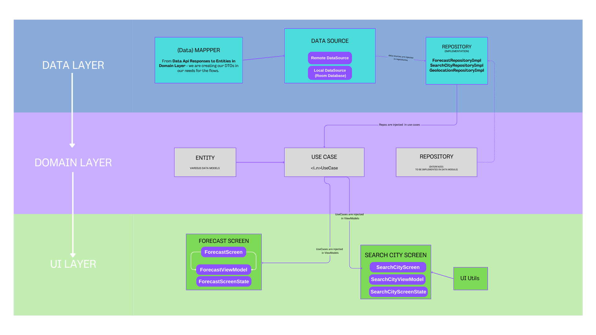

# ModernArchWeatherApp ☀
Weather Android App written in Jetpack Compose and Kotlin, the example of Modern architectural design pattern, clean code structure with clear separation of concerns
Modern Android App with Kotlin & Jetpack Compose 🚀
Welcome to BrutalWeatherApp Android application, developed with Modern Android Architecture in mind, Kotlin and the power of Jetpack Compose.
 
### What is there:
Unidirectional Data Flow: Ensuring a consistent and predictable behavior.
MVI Pattern: A robust pattern that simplifies user interactions and data updates.
Separated Concerns: Each layer has its distinct responsibility, promoting clarity and simplicity.
Single Source of Truth: All layers rely on one authoritative data source, eliminating inconsistencies.
Domain Layer: An optional layer that encapsulates all the business logic, making the app robust and efficient, making the app's core functions clear and concise.
Loose Coupling and DI: Used Dependency Injection pattern ensuring that components are independent yet interconnected, enhancing flexibility.

 

You can add your Weather API key in the Constants.kt [YOUR_API_KEY] file in the data/config folder.

  

## Api 📦
* [OpenWeather forecast endpoint, version 2.5](https://openweathermap.org/forecast5)

# Language 📚

Written in Kotlin, Jetpack Compose. 

## Architecture 🏗️
* [Modern App Architecture](https://developer.android.com/topic/architecture)

## Libraries 📚

* [Navigation](https://developer.android.com/jetpack/compose/navigation)

* [Retrofit](https://square.github.io/retrofit)

* [Location](https://developer.android.com/training/location)

* [Hilt](https://developer.android.com/training/dependency-injection/hilt-android)

* [Room](https://developer.android.com/jetpack/androidx/releases/room)

* [Accompanist](https://google.github.io/accompanist/insets/)

## Design 🖼

* [Inspired by design Weather App (neubrutalism style)
 by Yan Ageenko](https://www.pinterest.com/pin/839569555548055567/)

## Screens 🖼

### Forecast Screen 🏠

### Search City Screen 🔍

### Error Screens ⚠

### Video 👀
 

